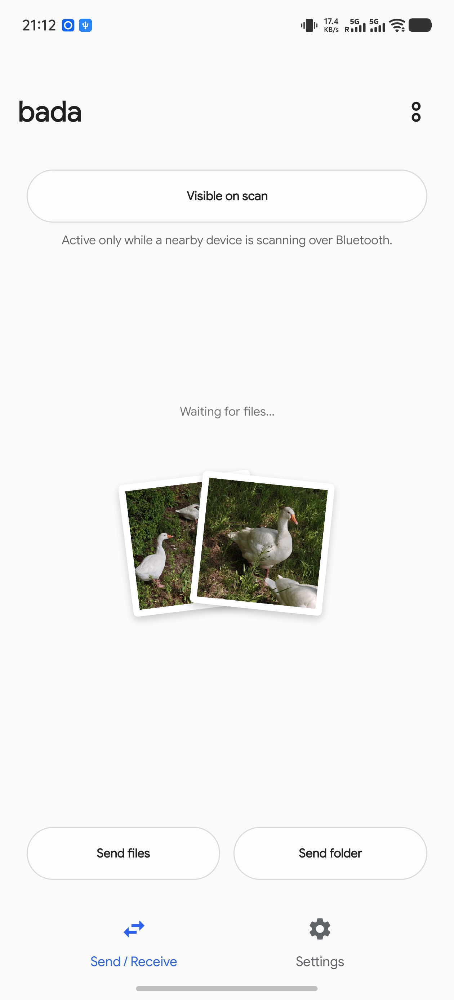
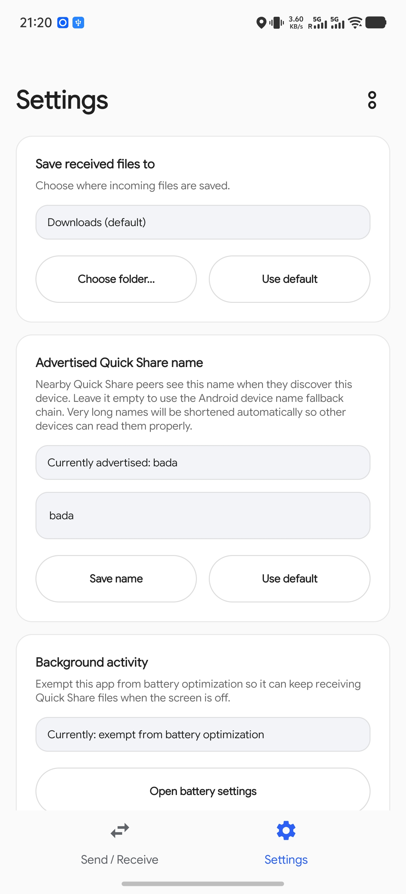

# Bada

바다는 Google Play 서비스를 사용하지 않고 **Quick Share/Nearby Share** 지원 장치와 파일을 주고받을 수 있는 Android 앱입니다.

해당 애플리케이션은 Android Quick Share, macOS의 NearDrop, 그리고 Windows의 Quick Share와의 상호 운용을 목표로 합니다.
AirDrop, AWDL, iPhone 검색 및 Apple 측과의 상호 운용은 지원하지 않습니다.




## 주요 기능
- 근처 Quick Share 발신자로부터 파일을 수신하여 다운로드 폴더 또는 앱에서 선택한 폴더에 저장합니다.
- Android 시스템 공유 시트에서 근처 Quick Share 대상 장치에게 파일을 전송합니다.
- 앱의 **폴더 보내기** 버튼을 사용하여 폴더를 전송하고, 수신자의 폴더 레이아웃을 그대로 유지합니다.
- Quick Share에서 전송받을 시 확인할 수 있는 4자리 PIN 확인 절차를 보여줍니다.
- 발신자에게 표시될 Quick Share 기기 이름을 수정할 수 있습니다.

Bada는 아직 개발 초기 단계의 프로젝트입니다. NearDrop과의 1단계 Wi-Fi LAN 호환성 작업은 완료되었으며, 현재 빌드에는 순정 Android 기기와의 BLE 기반 검색/부트스트랩 작업이 포함되어 있습니다.

## 설치

Bada는 Android 7.0 이상(`minSdk = 24`)을 지원합니다.

### 빌드된 APK 다운로드하기

사용자는 다음 [GitHub 릴리스 페이지](https://github.com/kyujin-cho/LibreDrop/releases)에서 서명된 릴리스 APK를 설치할 수 있습니다.

1. 최신 릴리스를 열고 `.apk` 파일을 다운로드합니다.
2. Android에서 설치 허용 여부를 묻는 메시지가 표시되면 브라우저 또는 파일 관리자에서 알 수 없는 출처의 앱 설치를 허용하세요.
Google의 Android 도움말 페이지에서 [다른 출처의 앱 다운로드](https://support.google.com/android/answer/9457058?hl=en)를 참조하세요.
3. 다운로드한 APK 파일을 열고 설치 메시지를 확인하세요.


### 소스 코드로부터 빌드하기

컨트리뷰터 및 개발자는 다음 명령어를 사용하여 디버그 APK를 빌드하고 단말기에 사이드로드할 수 있습니다.

```bash
./gradlew :app:assembleDebug
adb install -r app/build/outputs/apk/debug/app-debug.apk
```

필요 조건:

- JDK 17 및 Android SDK.
- 상호 운용성을 위해 Wi-Fi 및 Bluetooth를 활성화해야 합니다.

디버그 패키지 ID는 `dev.bluehouse.bada.debug`이며, 릴리스 빌드에서는 `dev.bluehouse.bada`를 사용합니다.

## 사용 방법

### 파일 / 폴더 수신하기

1. Bada 앱을 열고 필요한 권한을 부여하세요.
2. 수신 서비스가 실행 중인 상태로 유지됩니다. 알림에는 Bada가 수신 중인 Wi-Fi 네트워크가 표시됩니다.
3. 발신자의 펄스 (기기 탐색 신호)가 활성화되어 있지 않을 때에도 다른 기기에서 이 휴대폰을 볼 수 있도록 하려면 기기 상단의 스캔 상태 버튼을 눌러 **기기 항상 보이기**를 선택하세요.
4. 기본 저장 위치를 변경하고 싶은 경우, 설정 탭에서 **받은 파일 저장 위치** 항목을 통해 다른 폴더를 선택할 수 있습니다.
5. 발신자가 전송을 시작하면 PIN 번호를 확인하고 **수락**을 탭하세요.

수신된 파일은 선택한 폴더에 저장됩니다. 기본 폴더는 시스템 다운로드 폴더입니다.

### 파일 / 폴더 전송하기

1. 지원되는 모든 Android 앱에서 파일 공유 시트를 호출한 후, **Quick Share로 보내기**를 선택하세요.
2. 수신 측 상대방 단말기가 나타날 때까지 기다립니다.
3. 상대방을 탭하고 PIN 번호를 확인한 후 전송을 완료하세요.

폴더 전체를 공유하려면 **폴더 보내기**를 탭하세요.

## 호환성

| 단말기 | 예상되는 동작 |
| --- | --- |
| Pixel/GMS 기기의 순정 Android Quick Share | Shared Wi-Fi LAN이 기본 공유 경로로 설정되어 있습니다. BLE 지원 검색/부트스트랩은 순정 Android 실행 매뉴얼에 포함되어 있습니다. |
| Samsung Quick Share/One UI | Shared Wi-Fi LAN이 기본 공유 경로로 설정되어 있습니다. 최근 진행된 Galaxy S26 Ultra 및 Z Fold 7 단말 대상의 테스트에서도 BLE GATT 부트스트랩이 검증되었습니다. 노이즈가 많은 GATT 로그를 해석하기 전에 아래 Samsung 참고 사항을 읽어보세요.. |
| macOS의 NearDrop | 테스트되지 않음 |
| Windows 기기에서의 Quick Share | 테스트되지 않음 |

네트워킹 참고 사항:

- 공유 Wi-Fi는 mDNS 멀티캐스트가 허용된 동일한 SSID/VLAN을 의미합니다.
- 게스트 Wi-Fi, 클라이언트 격리, 라우팅된 VLAN 또는 엔터프라이즈 멀티캐스트 필터링으로 인해 단말기가 검색되지 않을 수 있습니다.
- Bluetooth Classic/RFCOMM은 사용자에게 표시되는 화면에서 의도적으로 노출되지 않습니다.

## 권한

Bada는 수신, 검색 및 전송과 관련된 권한만 요청합니다.
표시 범위:

- **주변 Wi-Fi 기기**: 로컬 네트워크에서 Quick Share 피어를 검색하고 알립니다.
- **Bluetooth 광고/스캔**: 주변 Quick Share 검색에 사용되는 BLE 펄스를 송수신합니다.
- **Bluetooth 연결**: BLE 직접 링크를 열고 주변 검색에 필요한 Bluetooth 어댑터 상태를 읽습니다.
- **알림**: 포그라운드 수신기, 수신 동의 요청 및 전송 진행 상황을 표시합니다.
- **이전 Android 버전의 위치**: Android 11 이하 버전에서는 BLE 스캔 결과 및 일부 Wi-Fi API를 위치 권한을 통해 처리합니다. Bada는 실제 위치 정보를 사용하지 않습니다.
- **배터리 최적화 예외**: 선택 사항이지만, 백그라운드 및 포그라운드 서비스를 적극적으로 중지하는 OEM 빌드에서 유용합니다.

## 문제 해결

- 단말기가 목록에 표시되지 않으면 먼저 두 기기를 동일한 Wi-Fi 네트워크에 연결하고, 게스트/클라이언트 격리를 비활성화하세요.
- 기본 Android 발신 기기에서 Bada를 찾을 수 없으면 Bada를 열고 **기기 항상 보이기**를 활성화하세요.
- Samsung 로그에 `등록된 핸들러 없음`이 표시되면 발신 기기 또는 수신 기기의 UI가 계속 진행 중인지 확인한 후 실패로 간주하세요.
- vivo/OriginOS/Funtouch OS에서 설치가 중단되는 경우, 단말기 제조사의 보안 정책으로 인해 사용자의 수동 설치 승인을 기다리고 있을 수 있습니다.
- 수신된 파일이 누락된 경우 선택한 저장 폴더와 전송이 **완료**되었는지 확인하세요.

## 프로젝트 문서

- [아키텍처](docs/architecture.md): 이전의 기여자/프로토콜 README를 그대로 보존했습니다.
- [순정 Android 상호 운용성 실행 설명서](docs/testing/interop-stock-quick-share-android.md)
- [NearDrop macOS 상호 운용성 실행 설명서](docs/testing/interop-neardrop-macos.md)
- [릴리스 빌드](docs/release.md)
- [연구 노트](docs/research/)
- [에이전트/기여자 안내](AGENTS.md)

## 빌드 및 테스트

```bash
./gradlew :app:assembleDebug
./gradlew :core-protocol:test
./gradlew staticAnalysis
./gradlew check
```

핵심 프로토콜 모듈은 순수 Kotlin/JVM으로 작성되었으며 의도적으로 `android.*` 임포트를 포함하지 않습니다.
Android 관련 검색, 서비스 및 UI는 별도의 모듈에 있습니다.
모듈 맵 및 프로토콜 읽기 가이드는 [아키텍처](docs/architecture.md)를 참조하세요.

## 참고 자료

- 프로토콜 사양: <https://github.com/grishka/NearDrop/blob/master/PROTOCOL.md>
- NearDrop 소스 코드: <https://github.com/grishka/NearDrop>
- Google의 UKEY2 핸드셰이크 사양: <https://github.com/google/ukey2>
