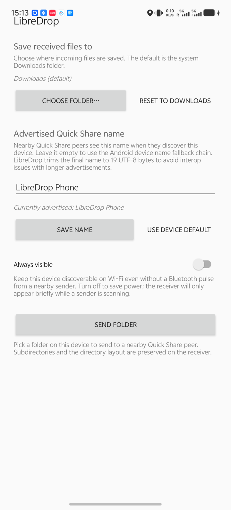

# LibreDrop

LibreDrop is an Android app for sending and receiving files with **Quick
Share / Nearby Share** peers without using Google Play Services for the
protocol implementation.

It targets interop with stock Android Quick Share, NearDrop on macOS, and
Quick Share on Windows. AirDrop, AWDL, iPhone discovery, and Apple-side
interop are out of scope.



## What It Does

- Receives files from nearby Quick Share senders and saves them to Downloads,
  or to a folder you choose in the app.
- Sends files from Android's system share sheet to nearby Quick Share peers.
- Sends folders from the app's **Send folder** button while preserving the
  folder layout on the receiver.
- Shows the same 4-digit confirmation PIN flow users expect from Quick Share.
- Lets you choose the advertised Quick Share device name shown to senders.

LibreDrop is still an early project. Phase 1 Wi-Fi LAN parity with NearDrop is
complete, and current builds include BLE-assisted discovery/bootstrap work for
stock Android peers.

## Install

There is not yet a packaged store release. Build and sideload the debug APK:

```bash
./gradlew :app:assembleDebug
adb install -r app/build/outputs/apk/debug/app-debug.apk
```

Requirements:

- Android 7.0 or newer (`minSdk = 24`).
- JDK 17 and an Android SDK when building from source.
- Wi-Fi and Bluetooth enabled for the best interop coverage.

The debug package id is `dev.bluehouse.libredrop.debug`; release builds use
`dev.bluehouse.libredrop`.

## Use It

### Receive

1. Open LibreDrop and grant the requested permissions.
2. Leave the receiver service running. The persistent notification shows the
   Wi-Fi network LibreDrop is receiving on.
3. Use **Always visible** when you want other devices to see this phone even
   when no sender pulse is active.
4. Keep the default save location, or choose another folder from **Save
   received files to**.
5. When a sender starts a transfer, compare the PIN and tap **Accept**.

Received files are written to the selected folder. The default is the system
Downloads folder.

### Send

1. Share a file from any Android app and choose **Send via Quick Share**.
2. Wait for a nearby peer row to appear.
3. Tap the peer, compare the PIN, and complete the transfer.

To send a whole folder, open LibreDrop and tap **Send folder**.

## Compatibility

| Peer | Current expectation |
| --- | --- |
| Stock Android Quick Share on Pixel / GMS devices | Shared Wi-Fi LAN is the baseline path. BLE-assisted discovery/bootstrap is covered by the stock Android runbook. |
| Stock Samsung Quick Share / One UI | Shared Wi-Fi LAN is the baseline path. Recent testing also validated BLE GATT bootstrap into a Galaxy S26 Ultra; read the Samsung note below before interpreting noisy GATT logs. |
| NearDrop on macOS | Supported over the shared Wi-Fi LAN path; use the NearDrop interop runbook for validation. |
| Quick Share on Windows | Protocol target; file interop should use the same Quick Share wire protocol, but keep device details in bug reports if behavior differs. |

Networking notes:

- Shared Wi-Fi means the same SSID/VLAN with mDNS multicast allowed.
- Guest Wi-Fi, client isolation, routed VLANs, or enterprise multicast
  filtering can make peers disappear.
- Bluetooth Classic/RFCOMM is intentionally not exposed in user-facing flows.

Samsung BLE GATT note:

- Earlier research described a possible Samsung certificate gate, but live
  testing on May 5, 2026 contradicted the absolute limitation. See
  [`docs/research/samsung-ble-gatt-cert-gate.md`](docs/research/samsung-ble-gatt-cert-gate.md)
  and
  [`docs/research/samsung-ble-gatt-limitation-rebuttal.md`](docs/research/samsung-ble-gatt-limitation-rebuttal.md).
- Treat Samsung `No handler registered` BLE logs as diagnostic noise unless
  they correlate with lack of UI or protocol progress.

## Permissions

LibreDrop asks only for permissions tied to receiving, discovery, and transfer
visibility:

- **Nearby Wi-Fi devices**: discovers and advertises Quick Share peers on the
  local network.
- **Bluetooth advertise / scan**: sends and listens for BLE pulses used by
  nearby Quick Share discovery.
- **Bluetooth connect**: opens BLE direct links and reads Bluetooth adapter
  state needed by nearby discovery.
- **Notifications**: shows the foreground receiver, incoming consent prompts,
  and transfer progress.
- **Location on older Android versions**: Android 11 and lower route BLE scan
  results and some Wi-Fi APIs through location permissions. LibreDrop does not
  use physical location.
- **Battery optimization exemption**: optional, but useful on OEM builds that
  aggressively stop background foreground services.

## Troubleshooting

- If no peers appear, first put both devices on the same Wi-Fi network and
  disable guest/client isolation.
- If a stock Android sender cannot see LibreDrop, open LibreDrop and enable
  **Always visible**.
- If Samsung logs show `No handler registered`, check whether the sender or
  receiver UI is still progressing before treating it as a failure.
- If installs stall on vivo / OriginOS / Funtouch OS, the vendor security
  prompt may be waiting for manual approval.
- If received files are missing, check the selected save folder and whether the
  transfer reached **Completed**.

## Project Docs

- [Architecture](docs/architecture.md): the contributor/protocol README that
  used to live here, preserved verbatim.
- [Stock Android interop runbook](docs/testing/interop-stock-quick-share-android.md)
- [NearDrop macOS interop runbook](docs/testing/interop-neardrop-macos.md)
- [Research notes](docs/research/)
- [Agent/contributor guidance](AGENTS.md)

## Build And Test

```bash
./gradlew :app:assembleDebug
./gradlew :core-protocol:test
./gradlew staticAnalysis
./gradlew check
```

The core protocol module is pure Kotlin/JVM and intentionally has no
`android.*` imports; Android-specific discovery, services, and UI live in
separate modules. See [Architecture](docs/architecture.md) for the module map
and protocol reading guide.

## Reference Material

- Protocol spec: <https://github.com/grishka/NearDrop/blob/master/PROTOCOL.md>
- NearDrop source: <https://github.com/grishka/NearDrop>
- Google's UKEY2 handshake spec: <https://github.com/google/ukey2>
